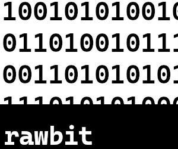

<div align="center">

<br>

# rawbit

A **camera RAW image preprocessor and importer** written in Rust.  

Rawbit processes raw image files by converting them to the DNG format in parallel,
while offering the ability to manipulate metadata and customize file name formatting.

</div>

## Features

- **RAW Image Conversion**: Converts camera RAW files to DNG format.
- **Flexible Input/Output**:
  - Process single files or entire directories.
  - Define output directories with optional overwrite support.
- **Custom Filename Formatting**: Supports user-defined naming conventions for output files.
- **Metadata Handling**: Supports EXIF metadata manipulation
- **Multi-Threaded Processing**: Leverages multiple CPU cores for parallel image processing.

*__all written in Rust, btw...__*

## Installation

## Installation

I plan on making binary releases available for all major platforms via package managers,
but in the meantime, you'll need to have the Rust toolchain installed:

1. Install [Rust](https://www.rust-lang.org/tools/install) and ensure `cargo` is available.
2. Install via cargo:
    ```sh
    cargo install rawbit
    ```

## Examples

### Convert a single file

```sh
rawbit --out-dir "./dng" --format "%Y-%m-%d_%H-%M-%S_{image.original_filename}" ./raw/ABC1234.ARW

# or 

rawbit -o"./dng" -F"%Y-%m-%d_%H-%M-%S_{image.original_filename}" ./raw/ABC1234.ARW
```

### Convert an entire directory

```sh
rawbit --in-dir "./raw" --out-dir "./dng" --format "%Y-%m-%d_{camera.model}_{lens.model}_{image.original_filename}"

# or

rawbit -i"./raw" -o"./dng" -F"%Y-%m-%d_{camera.model}_{lens.model}_{image.original_filename}"
```

## Usage

<div>
<pre>
<span style="color:teal;">rawbit</span> <span style="color:teal;">[OPTIONS]</span> <span style="color:teal;">--out-dir</span><span style="color:teal;"> </span><span style="color:teal;">&lt;DIR&gt;</span> <span style="color:teal;">&lt;--in-dir &lt;DIR&gt;|FILES&gt;</span>

<span style="color:olive;">Arguments:</span>
  <span style="color:teal;">[FILES]...</span>  individual files to convert

<span style="color:olive;">Options:</span>
  <span style="color:teal;">-i</span>, <span style="color:teal;">--in-dir</span><span style="color:teal;"> </span><span style="color:teal;">&lt;DIR&gt;</span>     directory containing raw files to convert
  <span style="color:teal;">-o</span>, <span style="color:teal;">--out-dir</span><span style="color:teal;"> </span><span style="color:teal;">&lt;DIR&gt;</span>    directory to write converted DNGs
  <span style="color:teal;">-F</span>, <span style="color:teal;">--format</span><span style="color:teal;"> </span><span style="color:teal;">&lt;FORMAT&gt;</span>  filename format of converted DNGs; see https://docs.rs/rawbit for info on syntax
  <span style="color:teal;">-a</span>, <span style="color:teal;">--artist</span><span style="color:teal;"> </span><span style="color:teal;">&lt;ARTIST&gt;</span>  value of the &quot;artist&quot; field in converted DNGs
      <span style="color:teal;">--embed-original</span>   embed the original raw image in the converted DNG
                         NOTE: conversion may take considerably longer
  <span style="color:teal;">-j</span>, <span style="color:teal;">--n-threads</span><span style="color:teal;"> </span><span style="color:teal;">&lt;N&gt;</span>    number of threads to use while processing input images, defaults to number of CPUs
  <span style="color:teal;">-f</span>, <span style="color:teal;">--force</span>            overwrite existing files, if they exist
  <span style="color:teal;">-h</span>, <span style="color:teal;">--help</span>             Print help
  <span style="color:teal;">-V</span>, <span style="color:teal;">--version</span>          Print version
</pre>
</div>

## Filename formatting

This is the distinguishing feature of `rawbit`.

### Date/time interpolation

You can insert the date-time information read from the RAW image's metadata using
syntax similar to libc's `strftime`.
More information can be found [here](https://docs.rs/chrono/latest/chrono/format/strftime/index.html)

### Metadata interpolation

Similar to the date/time interpolation, some well-known names in between squirly braces (i.e.
"{...}") expands into image-specific EXIF metadata in the filename:
| Variable      | Description | Example |
|---------------|-------------|---------|
| `camera.make` | Camera make | |
| `camera.model` | Camera model | |
| `camera.shutter_speed` | Shutter speed used to take the image | |
| `camera.iso` | Sensor sensitivity (ISO) used to take the image | |
| `lens.make` | Lens make | |
| `lens.model` | Lens model | |
| `lens.f_stop` | Lens aperture F stop value use to take the image | |
| `image.original_filename` | Image's original filename.<br>Automatically inserted if not specified in the original format string | |

*__Note:__*  
More metadata fields are a WIP, more to come soon...

## Why not use [`dnglab`](https://github.com/dnglab/dnglab)?

`dnglab convert` is extremely versatile, but the inability to format the resulting
converted DNG filenames is a dealbreaker coming from using Lightroom RAW import
tooling.

`rawbit`'s superpower is the ability to inspect the metadata of the file being converted
into the filename of the converted DNG, making batch image processing that much easier
to manage without expensive and proprietary software.

`rawbit` actually uses the same RAW image processing library that was created by
the maker of `dnglab`, named `rawler`.  
I owe a huge thanks to the DNGLab team for their awesome work that made this project possible.

## Special thanks

[DNGLab/Rawler](https://github.com/dnglab/dnglab/blob/main/rawler): Rust-native RAW image manipulation tools from the ground-up  
[rayon](https://github.com/rayon-rs/rayon): For making fearless concurrency a peice of cake  
[Adam Perkowski](https://github.com/adamperkowski): Contributing CI and package manager support  
